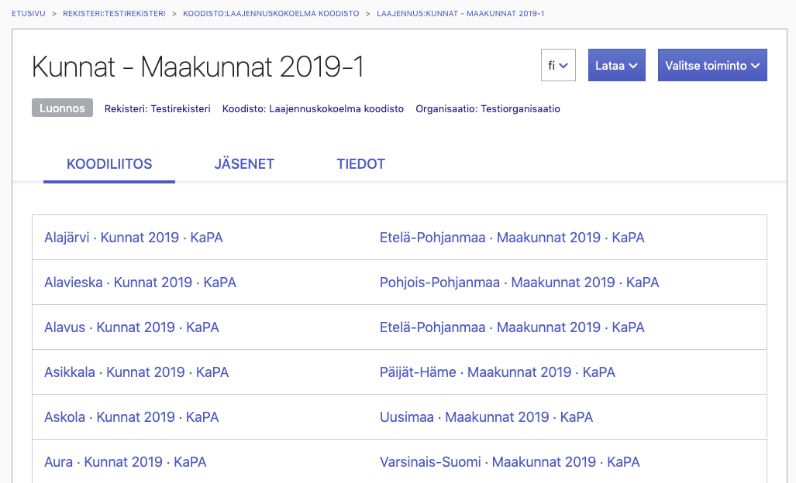

# Laajennuksiin liittyvät lisäykset Koodistot-työkalun käyttöohjeeseen

> Tämä dokumentti sisältää lisäyksiä Koodistot-työkalun käyttöohjeeseen. Lisäykset käsittelevät Koodistot-työkalun tukemaa laajennusmekanismia ja tuettuja laajennustyyppejä. Koodistot-työkalun tämänhetkinen käyttöohje löytyy täältä: https://vrk-ewiki.eden.csc.fi/x/WlRMAQ

 

# 10. Koodistojen laajennukset 

Koodistot-työkalu tarjoaa mekanismin, jonka avulla koodistojen ylläpitäjät voivat kontrolloidusti laajentaa koodiston tietosisältöä erilaisia tarpeita varten. Koodistot-työkalu tarjoaa tällä hetkellä vajaat kymmenkunta laajennuskokonaisuutta käytettäväksi ja uusia on mahdollista toteuttaa työkaluun tarpeen mukaan. Mikäli Koodistot-työkalun tarjoamat ominaisuudet eivät sellaisenaan riitä käyttötapaukseesi, saattaa uusi laajennuskokonaisuus olla ratkaisu ongelmaan. Otathan tällöin yhteyttä: yhteentoimivuus@vrk.fi

 

Koodistot-työkalun laajennusmekanismin keskeiset osat ovat *laajennustyyppi*, *laajennus* ja *jäsen*:

**Laajennustyyppi:**
- Laajennustyyppi määrittelee koodistoon liitettävissä olevat lisäominaisuudet sekä niiden semantiikan.
- Koodistot-työkalu tarjoaa tällä hetkellä vajaat kymmenkunta erilaista laajennustyyppiä käytettäväksi, kukin näistä liittää omanlaisiaan näkymiä ja/tai tietokenttiä osaksi koodistoa.
- Tuetut laajennustyypit on kuvattu tarkemmin kohdassa *Tuetut laajennustyypit*.

  
**Laajennus:**
- Laajennustyypin tarjoamat ominaisuudet otetaan käyttöön luomalla koodistoon laajennus.
- Koodistoon luodaan laajennus ja valitaan sille sovelias laajennustyyppi, sen mukaan mitä lisäominaisuuksia koodistossa halutaan hyödyntää.

  
**Jäsen:**
- Laajennuksen varsinainen sisältö koostuu jäsenistä.
- Jäsen sisältää laajennustyypin määrittelemät lisätietokentät sekä viittaukset koodeihin.

 

Koodistot-työkalun tarjoamat laajennustyypit ovat jaoteltavissa keskeisten ominaisuuksiensa puolesta kahteen kategoriaan: *hierarkialaajennuksiin* ja *koodilaajennuksiin*. Hierarkialaajennusten avulla voidaan muodostaa hierarkisia koosteita koodeista. Koodilaajennusten avulla puolestaan voidaan listätä koodeihin uusia tietokenttiä. 

**Hierarkialaajennus tyyppiset laajennustyyppit:**
- Mahdollistavat hierarkisten rakenteiden koostamisen koodeista.
- Liittävät hierarkian jäseniin ennalta määriteltyjä tietokenttiä, esimerkiksi nimi tai vastaavia tarkenteita.
- Ovat varsin yleiskäyttöisiä ja niitä voidaan käyttää laajasti erilaisissa käyttötapauksissa jäsentämään olemassa olevia koodeja.
- Eivät aseta rajotteita samaa laajennustyyppiä olevien laajennusten määrälle per koodisto.

**Koodilaajennus tyyppiset laajennustyypit:**
- Laajentavat koodia ennalta määrätyillä tietokentillä.
- Ovat tyypillisesti räätälöity tietyyn käyttötarkoitukseen ja rajaavat kenttien sallittuja arvoja.
- Rajoittavat että tiettyä laajennustyyppiä olevia laajennuksia voi olla enintään yksi per koodisto. 

 

**Koodistot-työkalun tukemat laajennustyypit:**

| Laajennustyyppi     | Arkkityyppi        | Kuvaus                                                       |
| ------------------- | ------------------ | ------------------------------------------------------------ |
| Määrityshierarkia   | Hierarkialaajennus | Mahdollistaa vaihtoehtoisen hierarkian muodostamisen koodeista. Hierarkiaan voidaan sisällyttää koodeja yhdestä tai useammasta koodistosta ja kustakin koodistosta voidaan ottaa joko kaikki tai osajoukko koodeista mukaan. Kullekin hierarkian jäsenelle voidaan antaa tarkentava nimi kuvaamaan jäsenen roolia hierarkiassa. |
| Laskentahierarkia   | Hierarkialaajennus | Perusominaisuuksiltaan vastaava kuin Määrityshierarkia -laajennus, mutta tukee lisäksi summaus- ja vertailuoperaattorien määrittämistä kullekin hierarkian jäsenelle. |
| Koodiliitos         | Hierarkialaajennus | Mahdollistaa yksisuuntaisen linkityksen muodostamisen koodien välille. Linkitettävät koodit voivat olla yhdestä tai useammasta koodistosta. |
| DPM Metric          | Koodilaajennus     | Lisää koodin tietosisältöön Data Point Modeling -metodologian mukaisen Metric käsitteen vaatimat kentät. Mahdollistaa näin DPM Metric käsitteiden esittämisen Koodistot-työkalun koodeina. |
| DPM Explicit Domain | Koodilaajennus     | Ominaisuuksiltaan vastaava kuin DPM Metric -laajennus, mutta sisältäen DPM Explicit Domain käsitteen kentät. |
| DPM Typed Domain    | Koodilaajennus     | Ominaisuuksiltaan vastaava kuin DPM Metric -laajennus, mutta sisältäen DPM Typed Domain käsitteen kentät. |
| DPM Dimension       | Koodilaajennus     | Ominaisuuksiltaan vastaava kuin DPM Metric -laajennus, mutta sisältäen DPM Dimension käsitteen kentät. |

 

## 10.2 Laajennukset

Kuhunkin koodistoon voi joustavasti luoda vain tarvittavat laajennukset. Laajennukset voi luoda jollain seuraavista tavoista:

-  Tuodaan koko koodiston sisältö Koodistot-työkaluun Excel-muodossa, siten että Excel-tiedosto sisältää koodiston perustietojen ja koodien lisäksi halutut laajennukset ja niiden jäsenet. Koodiston tuonti Excel-muodossa on kuvattuna *Uuden koodiston lisääminen > Koodiston tuonti Excelistä*. Laajennuksien käyttämät Excel-sarakeet ja -välilehdet on puolestaan kuvattu kohdassa *Laajennuksiin liittyvät Excel-elementit*.
-  Luodaan jo olemassa olevaan koodistoon halutut laajennukset sekä niiden jäsenet. Laajennukset voidaan luoda vaihtoehtoisesti: 
   - Tuomalla halutut laajennukset sekä niiden tiedot Excel-muodossa Koodistot-työkalun. Pelkkien laajennusten tuonti käyttää samoja, kohdassa *Laajennuksiin liittyvät Excel-elementit*, kuvattuja rakenteita kuin koko koodiston tuonti.  
   - Luomalla laajennukset Koodistot-työkalun käyttöliittymän kautta ja syöttämällä tarvittavat tiedot tarjottuja lomakkeita käyttäen. Laajennuksen luonti käyttöliittymän kautta on kuvattua kohdassa *Laajennuksen luominen koodiston tietokortin kautta*. Laajennuksen jäsenten luonti on puolestaan kuvattua kohdassa *Jäsenet*.  

      

### 10.2.1 Laajennuksen luominen koodiston tietokortin kautta 

Laajennuksia voidaan luoda koodiston tietokortilla olevan toimintovalikon kautta:

 

Toimintovalikkossa on seuraavat laajennuksien luomiseen liittyvät toiminnot. Osa toiminnoista ei ole saatavilla, mikäli koodisto sisältää jo kyseistä laajennustyyppiä olevan laajennuksen.

| Toiminto                | Selite                                                    |
| ----------------------- | --------------------------------------------------------- |
| Luo laskentahierarkia   | Lisää koodistoon laskentahierarkia-tyyppisen laajennuksen |
| Luo määrityshierarkia   | Lisää koodistoon määrityshierarkia-tyyppisen laajennuksen |
| Luo koodiliitos         | Lisää koodistoon koodiliitos-tyyppisen laajennuksen       |
| Luo DPM metric          | Lisää koodistoon DPM Metric laajennuksen                  |
| Luo DPM explicit domain | Lisää koodistoon DPM Explicit Domain laajennuksen         |
| Luo DPM dimension       | Lisää koodistoon DPM Dimension laajennuksen               |
| Luo DPM typed domain    | Lisää koodistoon DPM Typed Domain laajennuksen            |
| Tuo laajennuksia        | Lisää koodistoon laajennuksia Excel-muodosta tuomalla     |

 

Kun valitaan uuden laajennuksen luominen, avautuu valitun laajennustyypin mukainen syöttölomake, jolle täytetään vähintään pakolliset tiedot ja tallennetaan lopuksi laajennus Tallenna-painikkeesta. Lomakkeen sisältö ja vaaditut kentät riippuvat luotavan laajennuksen tyypistä. Seuraavassa esimerkkinä määrityshierarkian ja DPM dimensionin syöttölomakkeet.

 

### 10.2.2 Koodistoon kuuluvat laajennukset 

Koodistoon kuuluvat laajennukset listataan Koodiston tietokortin Laajennukset välilehdellä.  Laajennukset välilehteä ei ole saatavilla, mikäli koodistolla ei ole laajennuksia. Laajennukset on jaoteltu omille alemman tason välilehdille niiden tyypin mukaan: Koodiliitokset, Laskentahierarkiat, Määrityshierarkiat ja Koodilaajennukset. Alemman tason välilehdistä näytetään dynaamisesti vain ne, minkä tyyppisiä laajennuksia koodisto sisältää. 

 

### 10.2.3 Laajennuksen sisältö

Tietyn laajennuksen sisältöä voidaan tarkastella laajennuksen tietokorttin kautta. Laajennuksen tietokortilla on laajennuksen tyypistä riippuen 1-3 välilehteä: Koodiliitos, Jäsenet ja Tiedot. Näistä Tiedot-välilehti löytyy kaikilta laajennuksilta, Koodiliitos välilehti vain koodiliitos tyyppisiltä laajennuksilta ja Jäsenet välilehti kaikilta hierarkialaajennus -kategoriaan kuuluvilta laajennuksilta.

 

Laajennuksen tietokortin toimintovalikkossa on seuraavat toiminnot. Käytettävissä ole olevat toiminnot riippuvat laajennuksen tyypistä.

| Toiminto                             | Selite                                                       |
| ------------------------------------ | ------------------------------------------------------------ |
| Luo jäsen                            | Lisää laajennukseen uuden jäsenen. Jäsenen tiedot kysytään avautuvassa tietokortissa. |
| Luo laajennukselle puuttuvat jäsenet | Automaatinen toiminto laajennuksen jäsenien luomiseen. Lisää laajennukseen jäseniä, niin että kaikkia laajennukseen liitettyjen koodistojen koodeja vastaa laajennuksessa jäsen. Luotavien jäsenten tietoja ei kysytä. |
| Tuo jäseniä                          | Lisää laajennukseen uusia jäseniä Excel-muodosta tuomalla.   |
| Poista laajennus                     | Poistaa laajennuksen ja sen jäsenet.                         |

 

#### 10.2.3.1 Laajennuksen Tiedot-välilehti

Laajennuksen yleiset tunnus ja tyyppi tiedot listataan Laajennuksen Tiedot-välilehdellä. Välilehdellä esitettävien kenttien määrä riippuu laajennuksen tyypistä ja laajennuksen sisältämistä tiedoista.

 

Laajennuksen Tiedot-väliehdellä esitetään seuraavat tiedot. 

| Kenttä              | Selite                                                       |
| ------------------- | ------------------------------------------------------------ |
| Koodisto            | Koodisto, johon laajennus kuuluu.                            |
| Laajennuksen tunnus | Laajennuksen tunniste. Tunnus on yksilöivä koodiston sisällä. |
| Laajennuksen nimi   | Nimi, jolla laajennus näytetään listoissa ja hakutuloksissa. |
| Laajennustyyppi     | Määrittää minkä tyyppinen laajennus on kyseessä. Tuetut laajennustyypit on kuvattu kohdassa *Tuetut laajennustyyppit* |
| Ulkoiset koodistot  | Lista muista koodistoista, joihin tämän laajennuksen jäsenet voivat viitata. |
| Tila                | Laajennuksen tilakoodi.                                      |
| URI                 | Laajennuksen pysyvä tunniste.                                |
| Viimeisin muokkaus  | Viimeisimmän muokkauksen ajanhetki.                          |

 

#### 10.2.3.2 Laajennuksen Jäsenet-välilehti

Laajennuksen jäsenet listataan Jäsenet -välilehdellä. Jos listassa on jäsenen nimen edessä +-merkki, on jäsenellä alijäseniä. Alijäsenet saa tällöin näkyviin valitsemalla +-merkin listasta. Tietyn jäsenen tietoihin pääsee puolestaan valitsemalla kyseisen jäsenen nimen listasta.

 

#### 10.2.3.3 Laajennuksen Koodiliitos-välilehti

Koodiliitos tyyppisille laajennuksille esitetään erityinen Koodiliitos välilehti. Koodiliitos välilehti listaa  laajennuksen kaikki koodiliitokset (koodeista muodostetut parit). Valitsemalla listasta koodin nimen, pääsee  tarkastelemaan kyseisen koodin tietoja.

 

## 10.3 Jäsenet

Laajennuksen varsinainen sisältö koostuu jäsenistä. Jäseniä voidaan luoda olemassa olevaan laajennukseen seuraavilla tavoilla:
- Tuomalla laajennuksen jäseniä Excel-muodossa Koodistot-työkalun. Jäsenten tuonti käyttää kohdassa *Laajennuksiin liittyvät Excel-elementit* kuvattuja rakenteita.  
- Luomalla jäseniä Koodistot-työkalun käyttöliittymän kautta. Mekanismi jolla jäseniä luodaan, riippuu laajennuksen tyypistä:  
  - Hierarkialaajennusten jäsenten hallinta tapahtuu laajennuksen kautta. Näiden jäsenten luonti on kuvattua kohdassa *Hierarkialaajennuksen jäsenen luonti*. 
  - Koodilaajennusten jäsenten hallinta on yhdistetty koodien hallintaan. Koodilaajennusten jäsenten hallintaja on kuvattu kohdassa *Koodilaajennuksen jäsenien hallinta*.

 

### 10.3.1 Hierarkialaajennuksen jäsenen luonti

Hierarkialaajennus tyyppisille laajennuksille voidaan luoda jäseniä laajennuksen tietokortilla olevan toimintovalikon kautta:

 

Toimintovalikkossa on seuraavat jäsenen luomiseen liittyvät toiminnot.

| Toiminto    | Selite                                           |
| ----------- | ------------------------------------------------ |
| Luo jäsen   | Lisää laajennukseen uuden jäsenen                |
| Tuo jäseniä | Lisää koodistoon jäseniä Excel-muodosta tuomalla |

 

Kun valitaan uuden jäsenen luominen, avautuu laajennustyypin mukainen syöttölomake, jolle täytetään vähintään pakolliset tiedot ja tallennetaan lopuksi jäsen Tallenna-painikkeesta. Lomakkeen sisältö ja vaaditut kentät riippuvat laajennuksen tyypistä. Seuraavassa esimerkkinä koodiliitoksen jäsenen syöttölomake.

 

### 10.3.2 Koodilaajennuksen jäsenien hallinta

Koodilaajennukset laajentavat koodin tietosisältöä ennalta määritellyillä tietokentillä. Koodilaajennusten  tietokenttien syöttö ja käsittely Koodistot-työkalun käyttöliittymässä tapahtuu koodin tietokortin kautta. Taustalla Koodistot-työkalu hallinnoi koodilaajennusten jäseniä automaattisesti. Kun koodin tietokortissa syötetään tietoa koodilaajennuksen tietokenttiin, järjestelmä luo automaattisesti koodia vastaavan jäsenen laajennukseen ja tallettaa arvot tähän jäseneen. 

Ohessa esimerkkinä koodin syöttölomake DPM Metric tyyppisellä laajennuksella. Osa syötttölomakkeen sisällöstä on leikattu pois.

 

### 10.3.3 Laajennuksen jäsenen tiedot

Jäsenen tiedot listataan Tiedot-välilehdellä. Välilehdellä esitettävät kentät riippuvat laajennuksen tyypistä ja jäsenelle talletutuista tiedoista. Ohessa esimerkkinä koodiliitos tyyppisen laajennuksen jäsenen tiedot.

 

Alla kuvatut jäsenen Tiedot-välilehden kentät ovat yleisiä, eli ne ovat käytössä kaikillla laajennustyypeillä. Yleisten kenttien lisäksi osa laajennustyypeistä lisää jäsenen Tiedot -välilehdelle erityisiä laajennustyyppikohtaisia kenttiä. Nämä kentät on kuvattu kunkin laajennustyypin yhteydessä, kohdassa *Tuetut laajennustyypit*. 

| Kenttä             | Selite                                                       |
| ------------------ | ------------------------------------------------------------ |
| Koodisto           | Koodisto, johon jäsen kuuluu.                                |
| Laajennus          | Laajennus, johon jäsen kuuluu.                               |
| Jäsenen nimi       | Jäsenen nimi.                                                |
| Koodin URI         | Koodi pysyvä tunniste, siitä koodista jonka tietoja jäsen laajentaa. |
| Koodi              | Koodi, jonka tietoja jäsen laajentaa.                        |
| Voimassaolo        | Jäsenen alku ja loppupäivämäärä.                             |
| URI                | Jäsenen pysyvä tunniste.                                     |
| Muokkaaja          | Kuka on muokannut jäsenen tietoja viimeksi.                  | 
| Viimeisin muokkaus | Viimeisimmän muokkauksen ajanhetki.                          |

 

## 10.4 Laajennuksiin liittyvät Excel-elementit

Laajennukset lisäävät Koodistot-työkalun käyttämään Excel-muotoon sarakkeita ja välilehtiä. Näiden sarakkeiden ja välilehtien avulla ilmaistaan laajennusten ja niiden jäsenten tiedot.

**CodeSchemes-välilehti (Lisäys koodiston metatietoihin laajennuksiin liittyen)**

| Sarakkeen nimi  | Kuvaus                                                       | Pakollisuus |
| --------------- | ------------------------------------------------------------ | ----------- |
| EXTENSIONSSHEET | Linkittää koodiston ja siihen kytkettävät laajennukset yhteen.  Sarakkeen arvona on välilehden nimi, jolta kyseiseen koodistoon liitettävien laajennusten tiedot löytyvät. Linkitys tulee määritellä, mikäli koodistoon halutaan tuoda laajennuksia samalla Excel-tiedostolla. |             |

 

**Extensions-välilehti (Välilehdeltä tuodaan tiettyyn koodistoon liittyvät laajennukset ja niiden metatiedot)**

| Sarakkeen nimi | Kuvaus                                                       | Pakollisuus |
| -------------- | ------------------------------------------------------------ | ----------- |
| CODEVALUE      | Laajennuksen tunniste.                                       | x           |
| URI            | Laajennuksen URI. Generoituu CODEVALUE:n mukaan. Kenttä jätetään tyhjäksi uutta laajennusta tuotaessa. | x           |
| STATUS         | Tilakoodi. Tuonnissa on oletuksena DRAFT. Tieto on pakollinen. Tiloissa DRAFT (luonnos) ja SUBMITTED (odottaa hyväksyntää) olevia laajennuksia voi vapaasti muokata. Sallitut arvot ovat: DRAFT, SUGGESTED, SUBMITTED, VALID, SUPERSEDED, RETIRED ja INVALID. |             |
| PROPERTYTYPE   | Määrittää minkä tyyppinen laajennus on kyseessä, esimerkiksi  `definitionHierarchy`. Tuetut propertytype arvot on listattu laajennustyyppien tietojen yhteydessä. | x           |
| CODESCHEMES    | Lista muista koodistoistoista, johin tämän laajennuksen jäsenet voivat viitata. Puolipilkulla erotettu lista koodistojen URI:ja. |             |
| PREFLABEL_FI   | Laajennuksen nimi suomeksi.                                  | *x          |
| PREFLABEL_SV   | Laajennuksen nimi ruotsiksi.                                 | *x          |
| PREFLABEL_EN   | Laajennuksen nimi englanniksi.                               | *x          |
| STARTDATE      | Laajennuksen alkupäivämäärä. Päiväys ISO-8601 muodossa esim. 2018-01-16. |             |
| ENDDATE        | Laajennuksen loppupäivämäärä. Päiväys ISO-8601 muodossa.     |             |
| MEMBERSSHEET   | Linkittää laajennuksen ja siihen liittyvät jäsenet (members) yhteen. Sarakkeen arvona on välilehden nimi, jolta laajennukseen kuuluvien jäsenten tiedot löytyvät. |             |

 											

**Members-välilehti (Välilehdeltä tuodaan tietyn laajennuksen jäsenet ja niiden tiedot)**

Alla kuvatut Members välilehden sarakeet ovat yleisiä, eli ne pätevät kaikkiin Koodistot-työkalun tukemiin laajennuksiin. Yleisten sarakkeiden lisäksi osa laajennustyypeistä käyttää erityisiä laajennustyyppikohtaisia sarakkeita. Nämä sarakkeet on kuvattu kunkin laajennustyypin yhteydessä kohdassa *Tuetut laajennustyypit*. Lisäksi osa laajennustyypeistä vaikuttaa Members välilehden yleisten sarakkeiden semantiikkaan (esimerkiksi `RELATION` ).

| Sarakkeen nimi | Kuvaus                                                       | Pakollisuus |
| -------------- | ------------------------------------------------------------ | ----------- |
| MEMBER_ID      | Laajennuksen jäsenen numeerinen tunniste.                    | x           |
| URI            | Laajennuksen jäsenen URI. Generoituu MEMBER_ID:n mukaan. Kenttä jätetään tyhjäksi uutta jäsentä  tuotaessa. |             |
| CODE           | Viittaus koodiin, jota tämä jäsen edustaa.                   | x           |
| RELATION       | Viittaus toiseen jäseneen, johon tämä jäsen liittyy. Viittauksen semantiikka riippuu laajennuksen tyypistä. |             |
| STARTDATE      | Jäsenen alkupäivämäärä. Päiväys ISO-8601 muodossa esim. 2018-01-16. |             |
| ENDDATE        | Jäsenen loppupäivämäärä. Päiväys ISO-8601 muodossa.          |             |
| ORDER          | Jäsenen sijainti (järjestysnumero) jäsenten muodostamassa listassa. | x           |

 

# 10.5 Tuetut laajennustyypit

 

### 10.5.1 Määrityshierarkia -laajennustyyppi

Laajennustyypin tiedot:

| Arkkityyppi        | Propertytype          | Kuvaus                                                       |
| ------------------ | --------------------- | ------------------------------------------------------------ |
| Hierarkialaajennus | `definitionHierarchy` | Mahdollistaa vaihtoehtoisen hierarkkian muodostamisen koodiston koodeista. Vaihtoehtoiseen hierarkkiaan voidaan sisällyttää kaikki tai osajoukko koodiston koodeista ja lisäksi siihen voidaan ottaa mukaan koodeja myös muista koodistoista. Kullekkin laajennuksen jäsenelle voidaan antaa tarkentava nimi kuvaamaan jäsenen roolia hierarkiassa. |

Laajennustyypin lisäykset jäsenen tietokenttiin:

| Nimi                  | Excel-sarakkeen nimi | Huomiot                                                      |
| --------------------- | -------------------- | ------------------------------------------------------------ |
| Hierarkkinen yläjäsen | RELATION             | Määrityshierarkia -laajennustyyppi tarkentaa `RELATION` kentän semantiikkaa siten, että `RELATION` arvo on viittaus hierarkiseen yläjäseneen. |

 

Seuraavassa esimerkki määrityshierarkia -laajennustyyppin avulla muodostetusta vaihtoehtoisesta hierarkiasta.

 

### 10.5.2 Laskentahierarkia -laajennustyyppi

Laajennustyypin tiedot:

| Arkkityyppi        | Propertytype           | Kuvaus                                                       |
| ------------------ | ---------------------- | ------------------------------------------------------------ |
| Hierarkialaajennus | `calculationHierarchy` | Perusominaisuuksiltaan vastaava kuin Määrityshierarkia -laajennustyyppi, mutta tukee lisäksi matemaattisten summaus ja vertailu operaattorien määrittämistä kullekin laajennuksen jäsenelle. |

 

Laajennustyypin lisäykset jäsenen tietokenttiin:

| Nimi                      | Excel-sarakkeen nimi | Huomiot                                                      |
| ------------------------- | -------------------- | ------------------------------------------------------------ |
| Hierarkkinen yläjäsen     | RELATION             | Laskentahierarkia -laajennustyyppi tarkentaa `RELATION` kentän semantiikkaa siten, että `RELATION` arvo on viittaus hierarkiseen yläjäseneen. |
| Aritmeettinen operaattori | UNARYOPERATOR        | Sallitut arvot: `+` tai `-`                                  |
| Vertailuoperaattori       | COMPARISONOPERATOR   | Sallitut arvot: `=`, `<=`, `=<`, `<` tai `>`                 |

 

Seuraavassa esimerkki laskentahierarkia -laajennustyyppin avulla muodostetusta hierarkiasta.

 

### 10.5.3 Koodiliitos -laajennustyyppi

Laajennustyypin tiedot:

| Arkkityyppi        | Propertytype         | Kuvaus                                                       |
| ------------------ | -------------------- | ------------------------------------------------------------ |
| Hierarkialaajennus | `crossReferenceList` | Mahdollistaa yksisuuntaisen linkityksen muodostamisen koodien välille. Linkitettävät koodit  voivat olla yhdestä tai useammasta koodistosta. |

 

Laajennustyypin lisäykset jäsenen tietokenttiin:

| Nimi           | Excel-sarakkeen nimi | Huomiot                                                      |
| -------------- | -------------------- | ------------------------------------------------------------ |
| Liittyvä jäsen | RELATION             | Koodiliitos -laajennustyyppi tarkentaa `RELATION` kentän semantiikkaa siten, että `RELATION` arvo on viittaus koodiliitoksen toiseen osapuoleen. |

 

Seuraavassa esimerkki koodiliitos -laajennustyyppin koodiliitos listauksesta.

 

### 10.5.4 DPM Metric -laajennustyyppi

Laajennustyypin tiedot:

| Arkkityyppi    | Propertytype | Kuvaus                                                       |
| -------------- | ------------ | ------------------------------------------------------------ |
| Koodilaajennus | `dpmMetric`  | Lisää koodin tietosisältöön DPM Metric käsitteen vaatimat kentät. Mahdollistaa täten Data Point Modeling -metodologian mukaisten Metric käsitteiden esittäämisen Koodistot-työkalun koodeina. |

 

Laajennustyypin lisäykset jäsenen tietokenttiin:

| Nimi                | Excel-sarakkeen nimi  | Huomiot                                                      |
| ------------------- | --------------------- | ------------------------------------------------------------ |
| Data type           | DPMMETRICDATATYPE     | Sallitut arvot: `Enumeration`, `Boolean`, `Date`, `Integer`, `Monetary`, `Percentage`, `String`, `Decimal`, `Lei` tai `Isin` |
| Balance type        | DPMBALANCETYPE        | Sallitut arvot: `Credit` tai `Debit`                         |
| Flow type           | DPMFLOWTYPE           | Sallitut arvot: `Instant` tai `Duration`                     |
| Domain reference    | DPMDOMAINREFERENCE    | Sallitut arvot: vapaa teksti                                 |
| Hierarchy reference | DPMHIERARCHYREFERENCE | Sallitut arvot: vapaa teksti                                 |

 

Koodin tietokortissa DPM Metric laajennus näkyy seuraavasti:

 

### 10.5.5 DPM Explicit Domain -laajennustyyppi

Laajennustyypin tiedot:

| Arkkityyppi    | Propertytype        | Kuvaus                                                       |
| -------------- | ------------------- | ------------------------------------------------------------ |
| Koodilaajennus | `dpmExplicitDomain` | Lisää koodin tietosisältöön DPM Explicit Domain käsitteen vaatimat kentät. Mahdollistaa täten Data Point Modeling -metodologian mukaisten Explicit Domain käsitteiden esittäämisen Koodistot-työkalun koodeina. |

 

Laajennus lisää koodille seuraavat tietokentät:

| Nimi                    | Excel-sarakkeen nimi    | Huomiot                      |
| ----------------------- | ----------------------- | ---------------------------- |
| Member XBRL code prefix | DPMMEMBERXBRLCODEPREFIX | Sallitut arvot: vapaa teksti |

 

Koodin tietokortissa DPM Explicit Domain laajennus näkyy seuraavasti:

 

### 10.5.6 DPM Typed Domain -laajennustyyppi

Laajennustyypin tiedot:

| Arkkityyppi    | Propertytype     | Kuvaus                                                       |
| -------------- | ---------------- | ------------------------------------------------------------ |
| Koodilaajennus | `dpmTypedDomain` | Lisää koodin tietosisältöön DPM Typed Domain käsitteen vaatimat kentät. Mahdollistaa täten Data Point Modeling -metodologian mukaisten Typed Domain käsitteiden esittäämisen Koodistot-työkalun koodeina. |

 

Laajennustyypin lisäykset jäsenen tietokenttiin:

| Nimi      | Excel-sarakkeen nimi | Huomiot                                                      |
| --------- | -------------------- | ------------------------------------------------------------ |
| Data type | DPMDOMAINDATATYPE    | Sallitut arvot: `Boolean`, `Date`, `Integer`, `Monetary`, `Percentage`, `String`, `Decimal`, `Lei` tai `Isin` |

 

Koodin tietokortissa DPM Typed Domain laajennus näkyy seuraavasti:

 

### 10.5.7 DPM Dimension -laajennustyyppi

Laajennustyypin tiedot:

| Arkkityyppi    | Propertytype   | Kuvaus                                                       |
| -------------- | -------------- | ------------------------------------------------------------ |
| Koodilaajennus | `dpmDimension` | Lisää koodin tietosisältöön DPM Dimension käsitteen vaatimat kentät. Mahdollistaa täten Data Point Modeling -metodologian mukaisten Explicit Dimension ja Typed Dimension käsitteiden esittäämisen Koodistot-työkalun koodeina. |

 

Laajennustyypin lisäykset jäsenen tietokenttiin:

| Nimi             | Excel-sarakkeen nimi | Huomiot                      |
| ---------------- | -------------------- | ---------------------------- |
| Domain reference | DPMDOMAINREFERENCE   | Sallitut arvot: vapaa teksti |

 

Koodin tietokortissa DPM Dimension laajennus näkyy seuraavasti:

